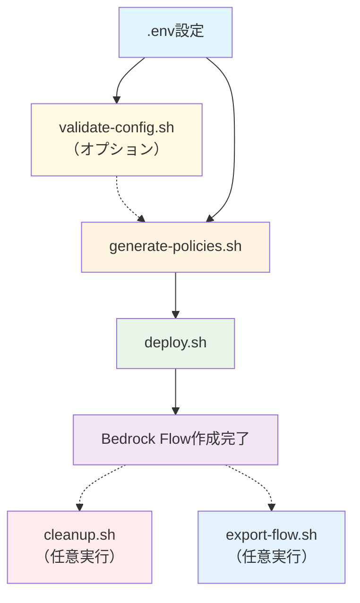

# テスト実行ログ RAG 分析フロー（Bedrock 専用構成）

## 概要

自動テスト実行後に出力される大量のログファイルを AI が分析・要約し、根本原因の推定や特に注目すべき失敗テストをまとめたサマリーレポートを生成する Bedrock Flows です。

**特徴**:

- Lambda や DB を使わず、Bedrock Models と Knowledge Bases のみで構成
- 環境変数ベースの簡単な設定管理
- ワンコマンドでデプロイ可能

## 前提条件

- ✅ AWS Bedrock Knowledge Base が既に作成済み
- ✅ Knowledge Base にエラーパターンや過去事例データが登録済み
- ✅ AWS CloudShell または実行権限のある環境（IAM権限が設定済み）

## アーキテクチャ

```
入力ログ → LogAnalyzer → SeverityClassifier → 重要度判定
              ↓
         ErrorExtractor → KnowledgeBaseSearch → ReportGenerator → 最終レポート
```

### ノード構成

1. **InputNode**: ログ内容の受け取り
2. **LogAnalyzer** (Prompt): ログを JSON 形式で構造化分析
3. **SeverityClassifier** (Condition): エラー重要度の自動判定（Critical/High/Medium/Low）
4. **ErrorExtractor** (Prompt): 重要なエラーメッセージとスタックトレースの抽出
5. **KnowledgeBaseSearch** (KnowledgeBase): 過去事例との照合と根本原因推定
6. **ReportGenerator** (Prompt): Markdown 形式の統合サマリーレポート生成
7. **OutputNode**: 最終レポートの出力

## スクリプト依存関係



**図の説明**:
- 実線：必須の実行フロー
- 点線：オプションまたは任意実行

### 全スクリプト一覧

| スクリプト名           | 目的             | 依存                           | 実行タイミング           |
| ---------------------- | ---------------- | ------------------------------ | ------------------------ |
| `validate-config.sh`   | 設定検証         | `.env`                         | デプロイ前（オプション） |
| `generate-policies.sh` | IAMポリシー生成  | `.env`                         | デプロイ時（自動）       |
| `deploy.sh`            | メインデプロイ   | `generate-policies.sh`, `.env` | 必須                     |
| `export-flow.sh`       | Flowエクスポート | `.env` (optional)              | 任意（バックアップ時）   |
| `cleanup.sh`           | リソース削除     | `.env`                         | 任意（削除時）           |

### スクリプト詳細

#### 1. `generate-policies.sh` - IAMポリシー生成
**目的**: .envの環境変数を使ってIAMポリシーテンプレートから実際のポリシーファイルを生成

**実行内容**:
- `.env`から環境変数を読み込み
- `config/iam-policies/`配下の全JSONテンプレートを処理
- `${AWS_REGION}`, `${AWS_ACCOUNT_ID}`等のプレースホルダーを実際の値に置換
- `generated-policies/`ディレクトリに出力

**生成されるファイル**:
- `trust-policy.json` - Bedrock用信頼ポリシー
- `bedrock-invoke-policy.json` - モデル呼び出し権限（特定モデルのみ）
- `knowledge-base-policy.json` - Knowledge Baseアクセス権限（特定KBのみ）
- `cloudwatch-logs-policy.json` - CloudWatch Logsアクセス権限（特定ログストリームのみ）

#### 2. `deploy.sh` - メインデプロイスクリプト
**目的**: Bedrock Flowsと必要なIAMリソースを一括デプロイ

**実行内容**:
1. `.env`ファイルの読み込みと必須変数チェック
2. Knowledge Baseの存在確認
3. `generate-policies.sh`を呼び出してポリシー生成
4. IAMロールの作成（存在しない場合）
5. 分割されたIAMポリシーを個別にアタッチ
6. フロー定義テンプレートから実際のフロー定義を生成
7. Bedrock Flowの作成と準備
8. `.env`にFLOW_IDを追記
9. テスト実行用JSONファイルの生成

**依存関係**:
- `generate-policies.sh`を内部で呼び出し
- `.env`の設定が必須
- `config/flow-template.json`が必要

#### 3. `cleanup.sh` - リソース削除（任意実行）
**目的**: デプロイしたリソースを一括削除

**実行タイミング**: リソースを削除したい場合のみ実行。通常の運用では不要。

**実行内容**:
1. `.env`から設定を読み込み
2. 削除対象リソースの確認プロンプト表示
3. Bedrock Flowの削除
4. 分割された全IAMポリシーの削除（`*-policy.json`パターン）
5. IAMロールの削除（他のポリシーがない場合のみ）
6. 生成ファイルの削除（`flow-definition.json`, `test-execution-generated.json`, `generated-policies/`）
7. `.env`からFLOW_ID行を削除

**安全機能**:
- 削除前に各リソースの存在を確認
- ロールに他のポリシーがある場合は削除をスキップ
- `.env`で指定されたリソースのみを対象

**注意**: Knowledge Baseは削除されません

#### 4. `validate-config.sh` - 設定検証（オプション）
**目的**: デプロイ前に設定と環境を検証

**実行タイミング**: デプロイ前の事前確認として任意で実行。デプロイエラーを事前に防ぐために推奨。

**実行内容**:
1. `.env`ファイルの存在確認
2. 必須環境変数のチェック
3. AWS認証情報の確認
4. AWSアカウントIDの照合確認
5. Knowledge Baseの存在確認
6. Bedrockモデルの確認
7. JSON設定ファイルの構文チェック

**使用例**:
```bash
bash scripts/validate-config.sh
```

#### 5. `export-flow.sh` - Flowエクスポート（任意実行）
**目的**: 既存のBedrock Flowをエクスポートしてバックアップ

**実行タイミング**: Flowのバックアップや移行が必要な場合に任意で実行。

**実行内容**:
1. `.env`からFLOW_IDを読み込み（または引数で指定）
2. `aws bedrock-agent get-flow`でFlow定義を取得
3. Flow定義をJSONファイルに保存
4. Flowメタデータを別ファイルに保存

**使用例**:
```bash
# .envにFLOW_IDが設定されている場合
bash scripts/export-flow.sh

# Flow IDを直接指定する場合
bash scripts/export-flow.sh <FLOW_ID>

# 出力ファイル名を指定する場合
bash scripts/export-flow.sh <FLOW_ID> my-flow-backup.json
```

**生成されるファイル**:
- `exported-flow-YYYYMMDD-HHMMSS.json` - Flow定義
- `flow-metadata-YYYYMMDD-HHMMSS.json` - Flowメタデータ

## クイックスタート

### 1. CloudShellでの環境準備

```bash
# AWS CloudShellを起動（AWSコンソールから）
# リポジトリをクローンまたはファイルをアップロード

# プロジェクトディレクトリに移動
cd TestFlows

# 設定ファイルのコピー
cp .env.example .env

# .env ファイルを編集（必須項目を設定）
vi .env  # CloudShellではviまたはnanoを使用
```

**必須設定項目:**

- `AWS_ACCOUNT_ID`: AWS アカウント ID
- `KNOWLEDGE_BASE_ID`: 既存の Knowledge Base ID
- `AWS_REGION`: デプロイ先リージョン（デフォルト: us-east-1）

### 2. 設定検証（オプション）

```bash
bash scripts/validate-config.sh
```

### 3. デプロイ

```bash
bash scripts/deploy.sh
```

デプロイ処理:

1. ポリシーファイルの生成（.env値を使用）
2. Knowledge Base の存在確認
3. IAM ロールの作成
4. 分割されたIAMポリシーの個別アタッチ
5. フロー定義ファイルの生成（環境変数展開）
6. Bedrock Flow の作成と準備
7. テスト実行用ファイルの自動生成

## テスト実行

### 方法 1: 生成されたテストファイルを使用

```bash
aws bedrock-agent invoke-flow \
  --flow-identifier <FLOW_ID> \
  --inputs file://test-execution-generated.json
```

### 方法 2: 直接ログ内容を指定

```bash
aws bedrock-agent invoke-flow \
  --flow-identifier <FLOW_ID> \
  --inputs '{"log_content": "2024-10-03 ERROR [Test] NullPointerException occurred"}'
```

### 方法 3: AWS コンソール

```
https://console.aws.amazon.com/bedrock/home?region=<REGION>#/flows/<FLOW_ID>
```

### 実行結果の確認

デプロイ完了後、`FLOW_ID`は`.env`ファイルに自動保存されます。

## ファイル構成

```
TestFlows/
├── config/
│   ├── flow-template.json              # フロー定義テンプレート（環境変数展開用）
│   └── iam-policies/                   # IAMポリシーテンプレート（最小権限設計）
│       ├── trust-policy.json           # Bedrock用信頼ポリシー
│       ├── bedrock-invoke-policy.json  # モデル呼び出し権限（特定モデルのみ）
│       ├── knowledge-base-policy.json  # KBアクセス権限（特定KBのみ）
│       └── cloudwatch-logs-policy.json # Logsアクセス権限（特定ストリームのみ）
├── scripts/
│   ├── generate-policies.sh    # IAMポリシー生成（.env値を使用）
│   ├── deploy.sh               # メインデプロイスクリプト
│   ├── cleanup.sh              # リソース削除スクリプト
│   ├── validate-config.sh      # 設定検証スクリプト
│   └── export-flow.sh          # Flowエクスポートスクリプト
├── data/
│   └── error-patterns.md       # ナレッジベース用サンプルデータ
├── docs/
│   └── model-configuration.md  # モデル設定ドキュメント
├── .env.example                # 環境変数テンプレート
├── .env                        # 環境変数設定（ユーザーが作成）
├── .gitignore                  # Git除外設定
├── LICENSE                     # ライセンスファイル
├── README.md                   # このファイル
├── generated-policies/         # 生成されたポリシー（deploy.sh実行時に作成）
├── flow-definition.json        # 実際のフロー定義（deploy.sh実行時に生成）
└── test-execution-generated.json # テスト実行用ファイル（deploy.sh実行時に生成）
```

### 主要ファイルの説明

**設定ファイル:**

- `.env.example`: 環境変数テンプレート（コピーして`.env`を作成）
- `config/flow-template.json`: 環境変数を含むフロー定義テンプレート
- `config/iam-policies/*.json`: 最小権限に分割されたIAMポリシーテンプレート

**スクリプト:**

- `scripts/generate-policies.sh`: .envの値を使ってポリシーファイルを生成
- `scripts/deploy.sh`: ワンコマンドデプロイスクリプト（generate-policies.shを内部で呼び出し）
- `scripts/cleanup.sh`: 作成したリソースの一括削除
- `scripts/validate-config.sh`: デプロイ前の設定検証
- `scripts/export-flow.sh`: 既存Flowのエクスポート

**データ:**

- `data/error-patterns.md`: よくあるエラーパターンと対処法のサンプル

## 環境変数設定

### 必須設定

| 変数名                | 説明                     | 例                         |
| --------------------- | ------------------------ | -------------------------- |
| `AWS_REGION`          | デプロイ先リージョン     | `us-east-1`                |
| `AWS_ACCOUNT_ID`      | AWS アカウント ID        | `123456789012`             |
| `KNOWLEDGE_BASE_ID`   | 既存の Knowledge Base ID | `ABCDEFGHIJ`               |
| `FLOW_NAME`           | フロー名                 | `test-log-analysis-flow`   |
| `EXECUTION_ROLE_NAME` | IAM ロール名             | `BedrockFlowExecutionRole` |

### オプション設定（推奨値）

| 変数名                     | 説明                         | デフォルト値                             |
| -------------------------- | ---------------------------- | ---------------------------------------- |
| `MODEL_ID_ANALYZER`        | ログ分析用モデル             | `us.amazon.nova-pro-v1:0`                |
| `MODEL_ID_EXTRACTOR`       | エラー抽出用モデル           | `us.amazon.nova-micro-v1:0`              |
| `MODEL_ID_QUERY_GENERATOR` | クエリ生成用モデル           | `us.amazon.nova-lite-v1:0`               |
| `MODEL_ID_REPORT`          | レポート生成用モデル         | `us.amazon.nova-pro-v1:0`                |
| `MODEL_ID_KNOWLEDGE_BASE`  | Knowledge Base検索用モデル   | `anthropic.claude-3-haiku-20240307-v1:0` |
| `MAX_TOKENS_ANALYZER`      | ログ分析の最大トークン数     | `3000`                                   |
| `MAX_TOKENS_EXTRACTOR`     | エラー抽出の最大トークン数   | `2000`                                   |
| `MAX_TOKENS_REPORT`        | レポート生成の最大トークン数 | `4000`                                   |
| `TEMPERATURE`              | モデルの温度パラメータ       | `0.1`                                    |
| `TOP_P`                    | モデルの Top-P パラメータ    | `0.9`                                    |
　
## 入力・出力形式

### 入力形式

```json
{
  "log_content": "テストログの内容（文字列）"
}
```

**入力例:**

```json
{
  "log_content": "2024-10-03 10:15:26 ERROR [DatabaseConnection] Connection failed: java.sql.SQLException: Access denied\n2024-10-03 10:15:31 FATAL [TestRunner] Database connection failed after 3 attempts"
}
```

### 出力形式

Markdown 形式のサマリーレポート:

```markdown
# 🔍 テスト実行サマリーレポート

**生成日時**: 2024-10-03 10:30:00
**重要度**: Critical

## 📊 実行概要

| 項目         | 値  |
| ------------ | --- |
| 総エラー数   | 5   |
| 総警告数     | 3   |
| 失敗テスト数 | 2   |

## 🚨 重要な問題

【重要なエラー 1】
エラータイプ: DatabaseConnection
メッセージ: Connection failed

## 🔍 根本原因分析

- **主要な原因**: データベース認証情報の問題
- **影響範囲**: 全テストスイート
- **緊急度**: Critical

## 💡 推奨アクション

### 🔥 緊急対応（24 時間以内）

- データベース認証情報の確認と修正
```

## IAMポリシー設計

### 最小権限の原則

本テンプレートでは、IAMポリシーを以下の4つに分割し、最小権限を実現しています：

1. **trust-policy.json** - Bedrock サービスのみが AssumeRole 可能
2. **bedrock-invoke-policy.json** - .envで指定された特定のモデルIDのみ呼び出し可能
3. **knowledge-base-policy.json** - .envで指定された特定のKnowledge Base IDのみアクセス可能
4. **cloudwatch-logs-policy.json** - 特定のログストリーム（/aws/bedrock/flows/${FLOW_NAME}*）のみアクセス可能

### ポリシーテンプレートの環境変数

各ポリシーファイルでは以下の環境変数プレースホルダーを使用：

- `${AWS_REGION}` - AWSリージョン
- `${AWS_ACCOUNT_ID}` - AWSアカウントID
- `${KNOWLEDGE_BASE_ID}` - Knowledge Base ID
- `${MODEL_ID_*}` - 各ノードで使用するモデルID
- `${FLOW_NAME}` - フロー名

これらは`generate-policies.sh`実行時に`.env`の値で置換されます。

## Knowledge Base の準備

このフローは既存の Knowledge Base を使用します。Knowledge Base には以下のようなデータを登録してください:

### 推奨データ構成

1. **エラーパターン集**: よくあるエラーとその対処法
2. **過去の障害事例**: 過去に発生した問題と解決方法
3. **トラブルシューティングガイド**: システム固有の対処手順

### サンプルデータ

`data/error-patterns.md`にサンプルデータがあります。

**含まれる内容:**

- データベース接続エラーの対処法
- NullPointerException の原因と対策
- タイムアウトエラーの解決方法

## トラブルシューティング

### デプロイエラー

**問題**: Knowledge Base ID が見つからない

```bash
# 利用可能なKnowledge Base一覧を確認
aws bedrock-agent list-knowledge-bases --query 'knowledgeBaseSummaries[*].[knowledgeBaseId,name,status]' --output table
```

**問題**: IAM ロールの権限エラー

- `config/iam-policies/`配下のポリシーテンプレートを確認
- `generated-policies/`の生成されたポリシーを確認
- 必要なリソースARNが正しく設定されているか確認

**問題**: モデルが利用できない

```bash
# 利用可能なモデル一覧を確認
aws bedrock list-foundation-models --query 'modelSummaries[*].[modelId,modelName]' --output table
```

### 実行エラー

**問題**: フローの実行が失敗する

1. CloudWatch Logs でエラー詳細を確認
2. 入力形式が正しいか確認
3. Knowledge Base にデータが登録されているか確認

## CloudShell利用時の注意事項

### セッションタイムアウト

CloudShellは一定時間操作がないとセッションがタイムアウトします。ホームディレクトリのファイルは保持されますが、一時ディレクトリのファイルは削除される可能性があります。

### ファイルアップロード

CloudShellにファイルをアップロードする場合:

1. CloudShellウィンドウ右上の「アクション」メニューから「ファイルのアップロード」を選択
2. プロジェクトフォルダ全体をZIPでアップロードして解凍

```bash
# ZIPファイルを解凍
unzip TestFlows.zip
cd TestFlows
```

### 必要なIAM権限

CloudShellを実行するIAMユーザー/ロールには以下の権限が必要です:

- `bedrock:*` (または `bedrock:CreateFlow`, `bedrock:GetKnowledgeBase` 等)
- `iam:CreateRole`, `iam:PutRolePolicy`, `iam:GetRole`
- `logs:CreateLogGroup`, `logs:CreateLogStream` (オプションtion-models --query 'modelSummaries[*].[modelId,modelName]' --output table
```

### 実行エラー

**問題**: フローの実行が失敗する

1. CloudWatch Logs でエラー詳細を確認
2. 入力形式が正しいか確認
3. Knowledge Base にデータが登録されているか確認

## クリーンアップ

作成したリソースを削除する場合:

```bash
bash scripts/cleanup.sh
```

**削除されるリソース:**

- Bedrock Flow
- IAM ロール
- 分割された全IAMポリシー（bedrock-invoke-policy, knowledge-base-policy, cloudwatch-logs-policy）
- 生成されたファイル（flow-definition.json, test-execution-generated.json, generated-policies/）

**注意**: Knowledge Base は削除されません。

## コスト見積もり

主なコスト要素:

- **Bedrock Model 呼び出し**: 入力/出力トークン数に応じた従量課金
- **Knowledge Base 検索**: クエリ数に応じた従量課金
- **CloudShell**: 無料（AWSアカウントに含まれる）

詳細は[AWS Pricing Calculator](https://calculator.aws)で見積もりを作成してください。

## ライセンス

MIT License

## サポート

問題が発生した場合:

1. `scripts/validate-config.sh`で設定を確認
2. CloudWatch Logs でエラー詳細を確認
3. AWS サポートに問い合わせ
